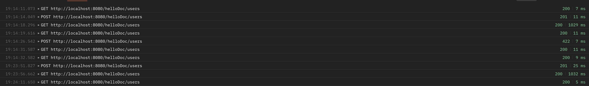

# mongo-sharding-repl
## Как исправлено приложение?
 - для кэшированного endpoint `GET /helloDoc/users` вместо дефолтного ключа `fastApi` в Redis используется кастомный ключ `users_cache`;
 - добавлена инвалидация кэша в методе `POST /helloDoc/users` по ключу `users_cache`;
## Как запустить?
1. Запускаем кластер mongodb (сервер конфигурации, 2 шарда по 3 реплики, роутер), standalone Redis и приложение.
```shell
docker compose up --build -d
```
2. Выполняем скрипт инициализации для сервера конфигурации и реплицированных шардов. 
```shell
[./scripts/mongo_config-repl-shards-init.sh](scripts/mongo_config-repl-shards-init.sh)
```

3. Выполняем скрипты инициализации для роутера и заполнения шардированной коллекции `somedb.helloDoc`.
```shell
[./mongo_router-sharded-data-init.sh](scripts/mongo_router-sharded-data-init.sh)
```
- скрипт также сразу вернет общее кол-во документов на всех шардах.

**Примечание**: 
- Скрипты п.2-3 нужно выполнить только 1 раз, при рестарте `docker compose down/up` конфигурация и данные сохранятся.
## Как проверить работу приложения?
- Выполнить `docker ps` - все контейнеры кластера mongo должны быть `healthy`.
- Выполнить скрипт [./scripts/mongo_check-shards.sh](scripts/mongo_check-shards.sh) и проверить кол-во документов на каждой реплике обоих шардов; число документов в пределах шарда должно быть одинаковое на каждой реплике
- Открыть в браузере http://localhost:8080.
- Проверить работу эндпойнтов, список которых можно найти по http://localhost:8080/docs.
## Как проверить работу кэширования в GET /helloDoc/users?
- первый запрос GET выполняется значительно дольше (около секунды в среднем), чем повторные (десятки мс);
- после POST запроса с созданием нового юзера, кэш инвалидируется и новый GET запрос снова вытаскивает данные из БД;
- можно воспользоваться коллекцией [BlackFriday Users Cache Test.postman_collection.json](BlackFriday%20Users%20Cache%20Test.postman_collection.json) для попереременной отправки POST и GET запросов, чтобы увидеть инвалидации и прогревы кэша;

